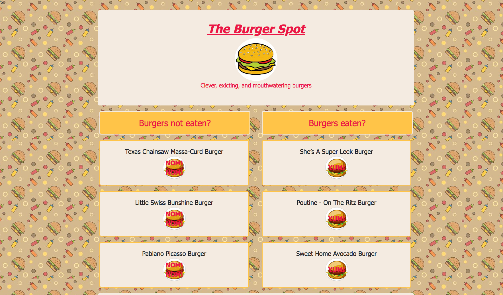
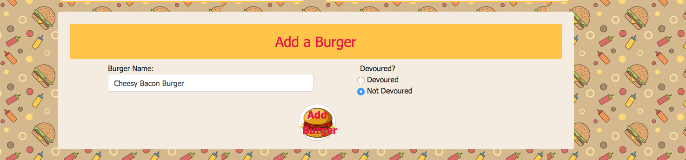
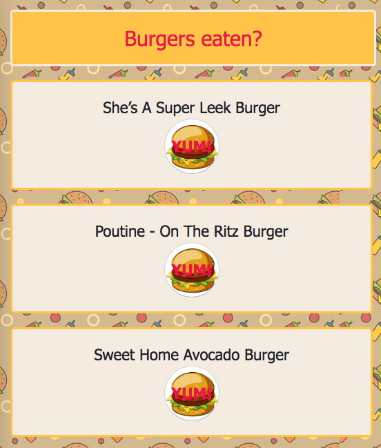
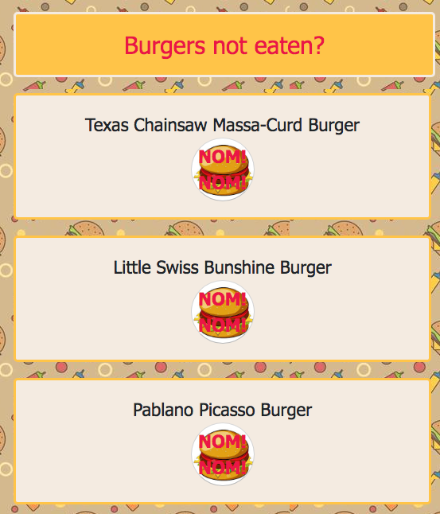

# Burger Spot

## Overview

This app is a pretty simple app. The theme is burgers, so a user is able to add a burger and select whether they have eaten it (devoured) or haven't eaten it (not devoured). Once you have selected the button NOM! NOM! it will switch over to the corrosponding column and the button reads YUM!.

## Screenshots

Here are some screen shots that show how to use the app.

### Main view

### Adding Burger

### Selecting Eaten

### Selecting Not Eaten

